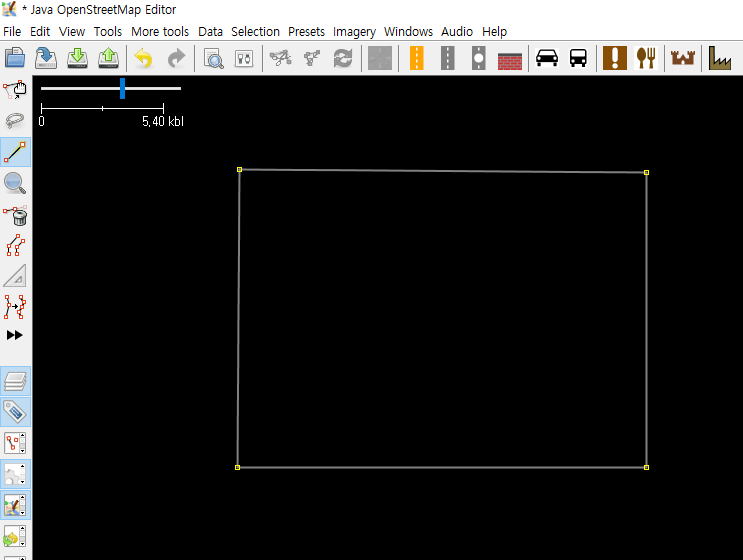
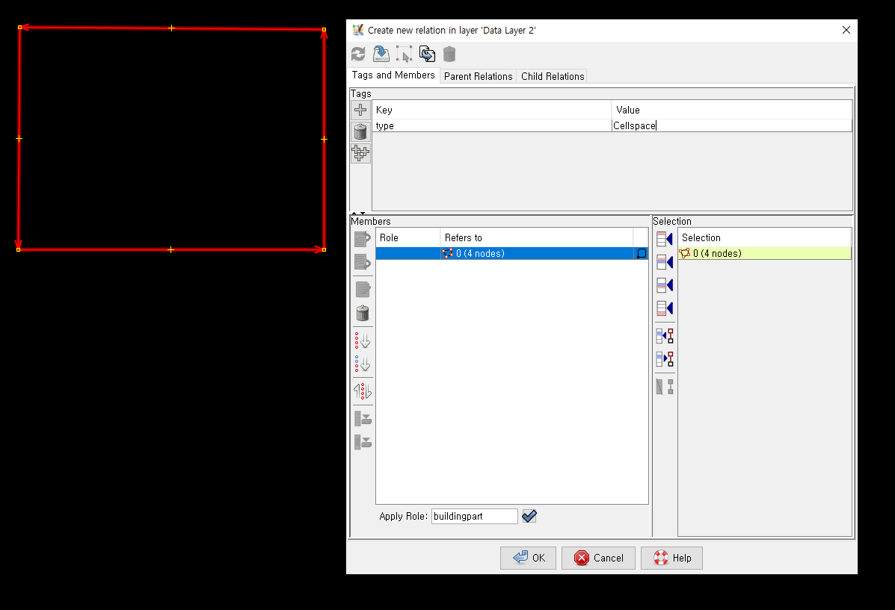
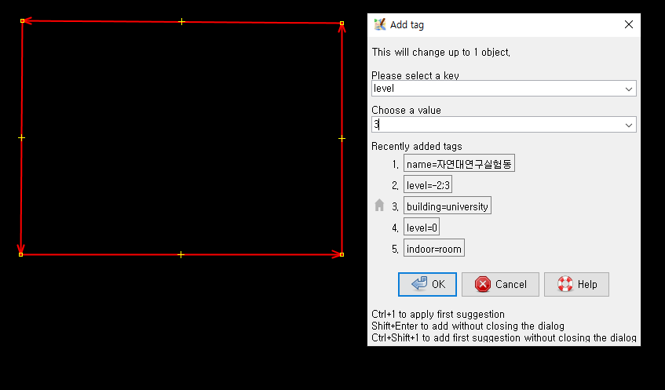
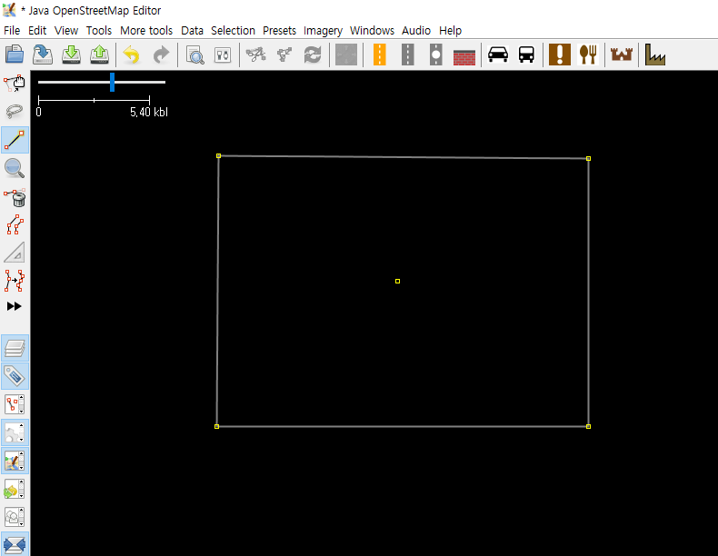
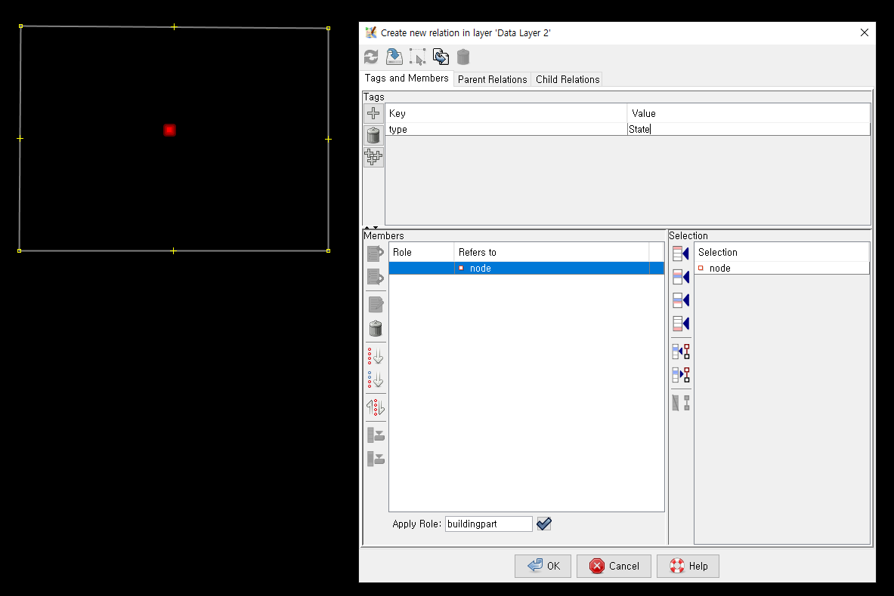
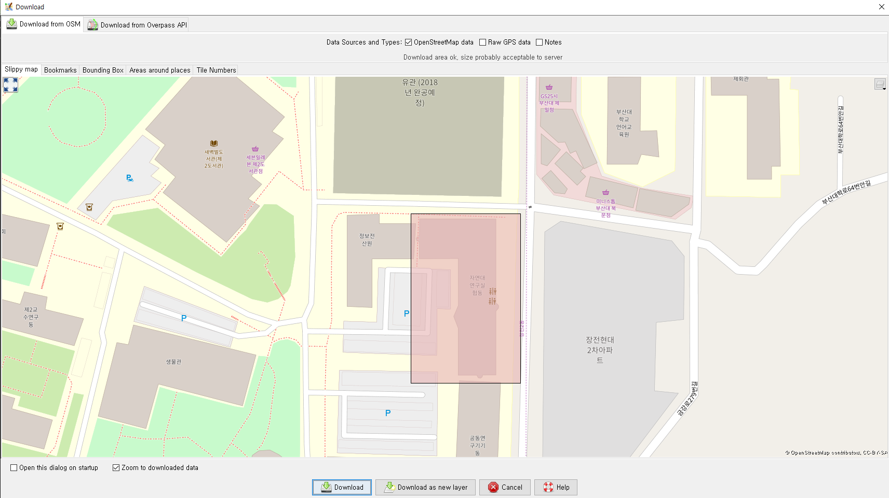
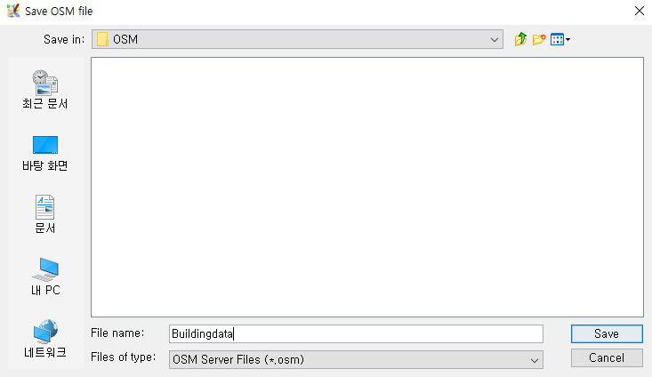
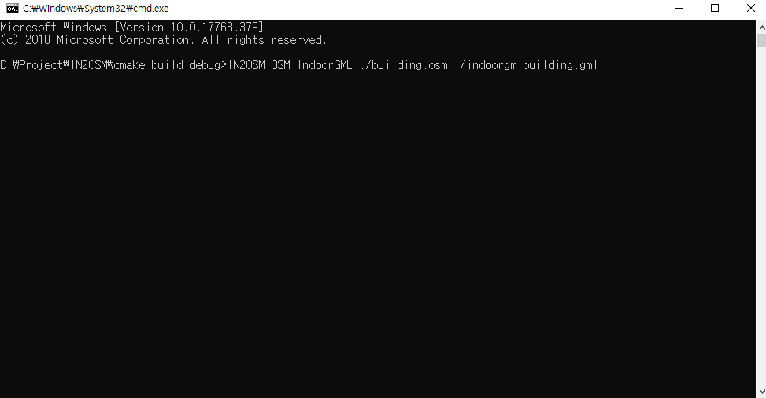

Handling IndoorGML in JSOM
=============
*   If you want to handle the Indoorgml file in JOSM, you have to follow some rules.

*   All Indoorgml relationships are defined as osm [relation](https://wiki.openstreetmap.org/wiki/Relation).

*   This approach can help to study the real coordinates of Indoorgml.

## Quick Start 
- We create one cellspace and one state and define duality.
1. Create polygon in JOSM 
   </img>
2. The generated polygon is assigned to the cellspace using the relation of osm. 
   </img>
3. If you use a tag in josm, it is reflected in indoorgml.
   </img>
4. Create Point in JOSM 
     </img>
5. The generated point is assigned to the state using the relation of osm. 
   </img>
6. The duality is defined using the relation of osm. 
   </img>
7. Save osm file 
   </img>
8. Convert osm -> Indoorgml
   </img>