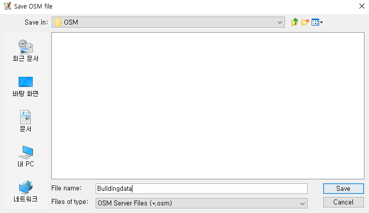
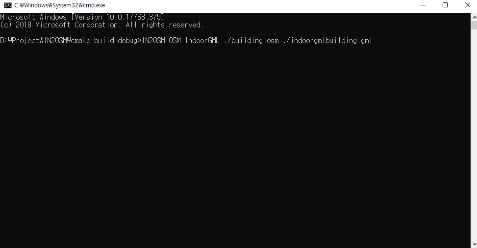

IN2OSM
=============

IN2OSM is an open source C++ program that provides tools for simple converter Indoorgml<->osm.
* Prerequisites
       - Openlevelup : (https://openlevelup.net)  
       Verify that osm indoor data is present or not. 
        </img>
        
## Quick Start   *OSM->IndoorGML*
A simple example to create IndoorGML from OSM data.
1. Download osm data using josm(https://josm.openstreetmap.de). 
   </img>
   
2. Save osm data 
    </img>
    
3. IN2OSM OSM Indoorgml [inputfile_path] [outputfile_path]. 
    </img>

## *IndoorGML->OSM*
* Only support core module Indoorgml
1. IN2OSM Indoorgml OSM [inputfile_path] [outputfile_path]. 
   </img>
